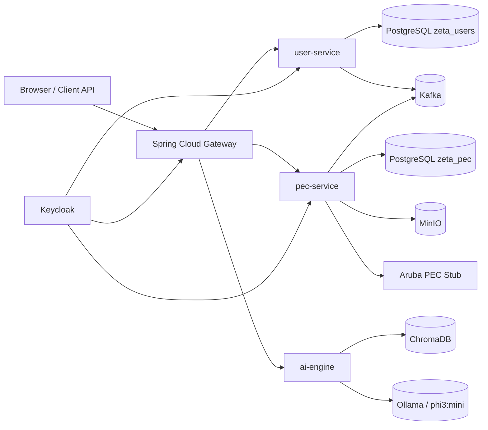
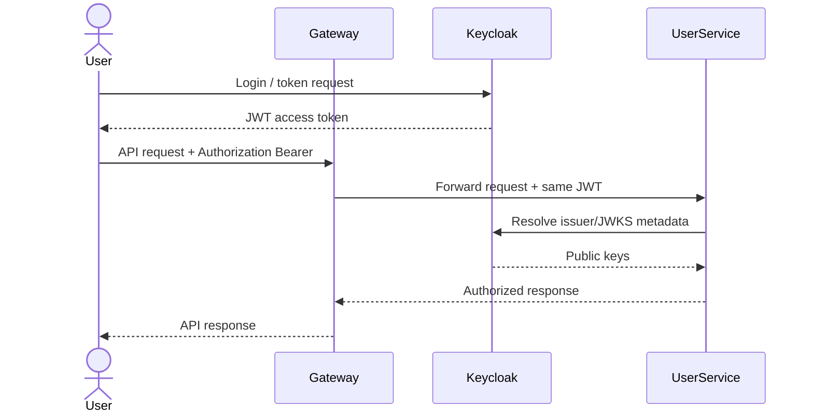
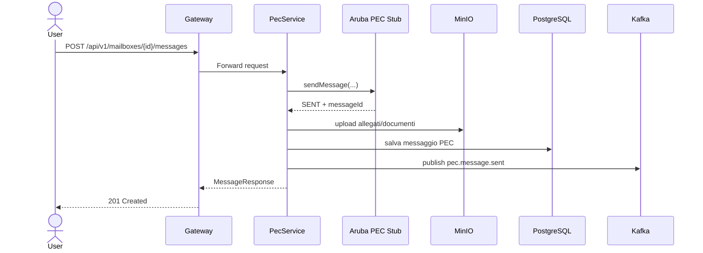
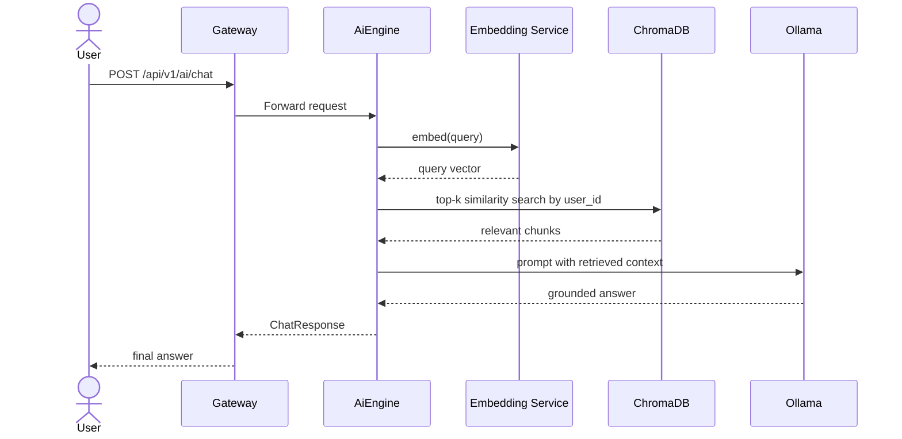
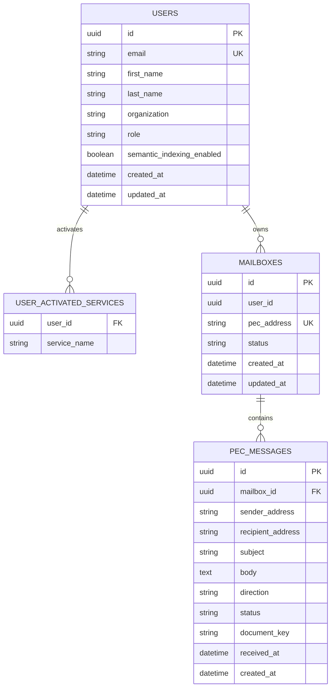

# Piattaforma Zeta — Architettura

## Obiettivo

La piattaforma dimostra un'architettura a microservizi on-premise orientata a servizi Aruba, autenticazione centralizzata e pipeline AI locale basata su RAG. In locale tutto gira con `docker-compose`, mentre i componenti restano predisposti per un'evoluzione verso Kubernetes.

## Architettura complessiva



## Sequenza — autenticazione



## Sequenza — invio PEC



## Sequenza — chat RAG



## ERD



## Deployment Kubernetes di esempio

> Solo a scopo documentale: in locale il progetto usa `docker-compose`.

```yaml
apiVersion: apps/v1
kind: Deployment
metadata:
  name: user-service
spec:
  replicas: 2
  selector:
    matchLabels:
      app: user-service
  template:
    metadata:
      labels:
        app: user-service
    spec:
      containers:
        - name: user-service
          image: ghcr.io/example/piattaforma-zeta/user-service:latest
          ports:
            - containerPort: 8081
          env:
            - name: SPRING_PROFILES_ACTIVE
              value: kubernetes
          readinessProbe:
            httpGet:
              path: /actuator/health/readiness
              port: 8081
            initialDelaySeconds: 10
            periodSeconds: 10
          livenessProbe:
            httpGet:
              path: /actuator/health/liveness
              port: 8081
            initialDelaySeconds: 20
            periodSeconds: 20
          resources:
            requests:
              cpu: "250m"
              memory: "512Mi"
            limits:
              cpu: "1000m"
              memory: "1024Mi"
---
apiVersion: v1
kind: Service
metadata:
  name: user-service
spec:
  selector:
    app: user-service
  ports:
    - name: http
      port: 80
      targetPort: 8081
  type: ClusterIP
```

## Note architetturali

- **Autenticazione**: Keycloak emette JWT validati dai microservizi Spring Security.
- **Messaging**: Kafka gestisce eventi asincroni come `user.service.activated` e `pec.message.sent`.
- **Storage documentale**: MinIO funge da object storage S3-compatible per contenuti PEC.
- **AI locale**: il motore RAG usa embeddings locali, ChromaDB per il retrieval e Ollama per l'inferenza LLM.
- **Produzione vs demo**: la demo privilegia semplicità di esecuzione; la documentazione resta compatibile con un deployment Kubernetes/Helm più evoluto.
